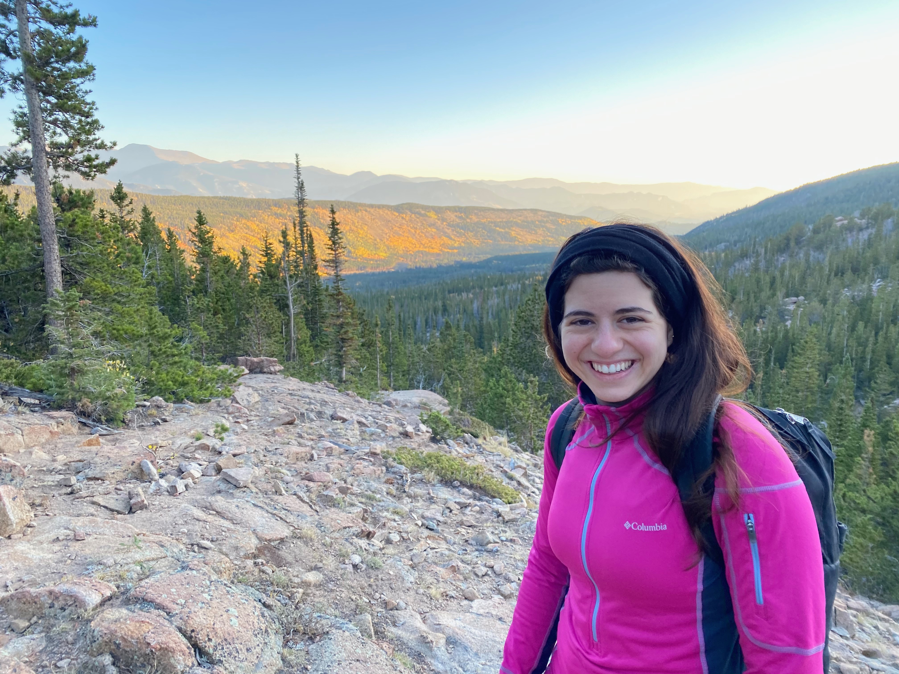

{width=40%}

Hi! I am a Post Doctoral Fellow currently working with Drs. [Rebecca Hubbard](https://hubbard-lab.notion.site/Real-world-Evidence-Generation-and-Acceleration-with-Robust-Data-Science-REGARDS-Lab-7aeb4718f34048318cdd6b242cf80978) and [Blanca Himes](https://www.himeslab.org/) on statistical methods for analyzing EHR data with a focus on asthma outcomes. I previously completed my PhD in Biostatistics at Columbia University Mailman School of Public Health under the guidance of [Dr. Linda Valeri](https://www.lindavaleri.com/). My doctoral research focused on the evaluation of the external validity of epidemiological investigations on environmental mixtures and on the evaluation of the current available machine learning approaches for the analysis of environmental mixtures on time-to-event outcomes. My research interests include causal inference methods, global health, health disparities and environmental health. In my free time, I enjoy hiking, reading, and spending time with friends!

\

Check out my CV [here](about.html).

\
\
\

#### Contact Information
Melanie Mayer \
[Department of Biostatistics, Epidemiology and Informatics](https://www.dbei.med.upenn.edu/) \
[University of Pennsylvania Perelman School of Medicine](https://www.med.upenn.edu/) \
423 Guardian Dr \
Philadelphia, PA 19104

Email: <melanie.mayer@pennmedicine.upenn.edu>

